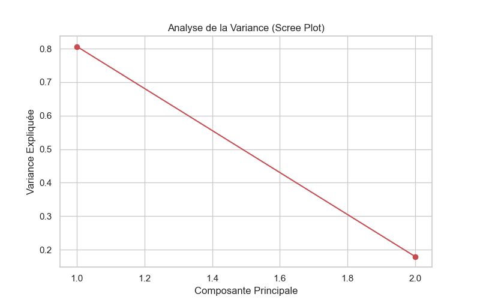

# Rapport d'Analyse Prédictive des Urgences

**Entropie Initiale :** 1.5626
**Gain d'Information (Nom Installation) :** 0.0409

## Comparaison des Modèles
|                     |   Accuracy |   Precision |   Recall |   F1-Score |   Temps (sec) |
|:--------------------|-----------:|------------:|---------:|-----------:|--------------:|
| Itération 1 (Brute) |    1       |    1        |  1       |    1       |    0.0139596  |
| Itération 2 (PCA)   |    0.73913 |    0.859903 |  0.73913 |    0.73913 |    0.00332594 |

## Anomalies Détectées
Nombre d'installations critiques : 1

