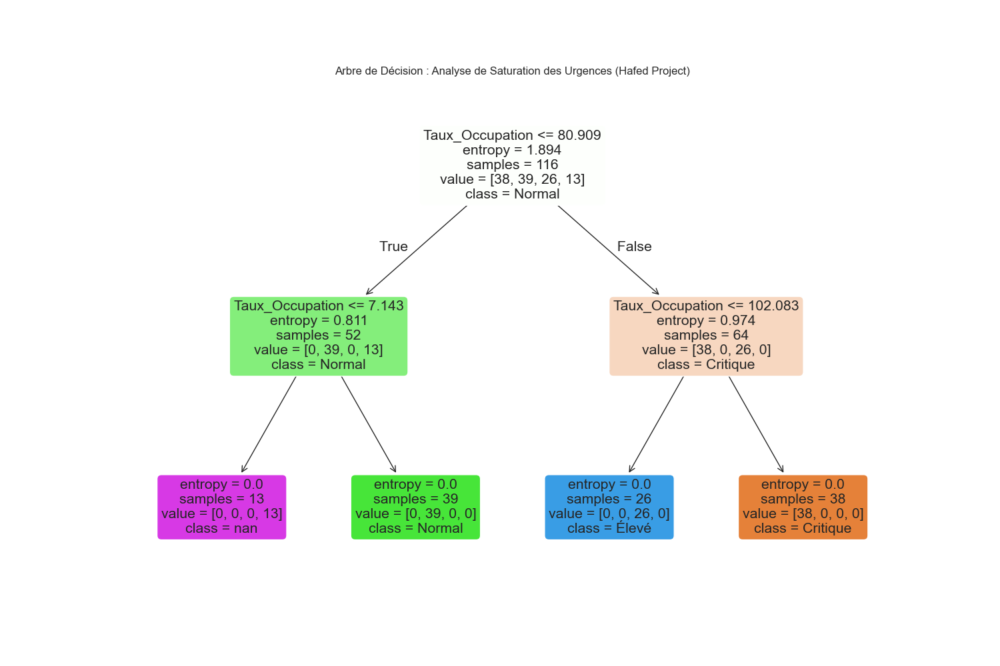

# 🏥 Analyse de Situation des Urgences

**Entropie calculée :** 1.5626

### Distribution des états :
| Situation_Calculée   |   proportion |
|:---------------------|-------------:|
| Normal               |     0.378641 |
| Critique             |     0.368932 |
| Élevé                |     0.252427 |
## 🧠 Analyse de Machine Learning Avancée
- **Gain d'Information (Feature Selection) :** 0.0409
- **Seuil d'anomalie statistique :** 174.61%
- **Installations en saturation extrême :** 1

### 🌲 Modèle de Décision :

*Note : Ce modèle permet d'anticiper les ruptures de service basées sur l'entropie du système.*